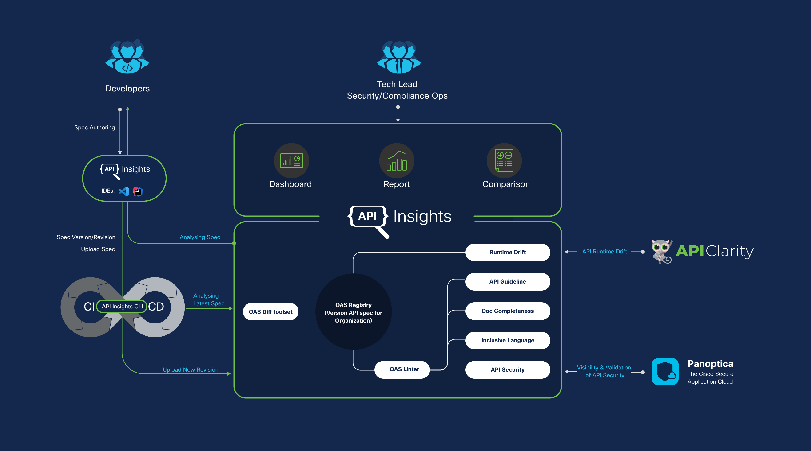

# API Insights
[](https://developer.cisco.com/site/api-insights/)

[API Insights](https://developer.cisco.com/site/api-insights/) is a tool to enable organizations to manage versioned API specifications (Swagger 2.0/OpenAPI Spec 3.x) for services. It also does static analysis of API spec files for compliance against REST API best practices guidelines, document completeness, inclusive language check and runtime API drift from documented spec. To help API consumers and developers, API Insights service also supports generating an API changelog including identification of backward compatibility breaking changes between 2 versions of API spec files.

## API Specifications Challenges

- As the number of services increases, no common place for storing versioned API specs.
- Inconsistency in API specifications across teams. Makes it difficult for API consumers that integrate across multiple APIs.
- API changes across versions could result in breaking backward compatibility.
- Lack of consistent documentation of API changes across multiple releases.

## Solution

https://user-images.githubusercontent.com/5516389/200955566-95b6f53d-963a-4440-8c20-1b9f4aca68b1.mp4

- API Insights service enables storing of multiple versions of released (& release candidate) API specifications.
- Validate & Score API Spec against guidelines:   
   - [API Insights REST guidelines](https://developer.cisco.com/docs/api-insights/#!rest-guidelines-ruleset)
       - Guidelines are tested using **[API guidelines linter](https://github.com/cisco-developer/api-insights-openapi-rulesets)**
   - [API Document completeness](https://developer.cisco.com/docs/api-insights/#!documentation-completeness-ruleset)
   - [Inclusive Language Ruleset](https://github.com/cisco-open/inclusive-language)  
   - API Drift analyzer (Integrate with [APIClarity](https://apiclarity.io) to identify Zombie and Shadow APIs)
   - API Security analyzer (*Future*: Integrate with [Panoptica](https://panoptica.app/) to enable API Security analyzer)
- API spec diff across multiple versions/revisions
  - Identify and alert on backward compatibility breaking changes.
  - API Insights CLI to enable running spec analyzer as a part of API spec CI/CD or local commit pipeline.


## User Flow and Architecture


**User Flow**
- Developer or Tech Lead can upload the API Specification and subsequent revisions:
  - Commit new version/revision of spec in GitHub repository.
  - CI/CD pipeline with specs analysis against guidelines & generate report/score.
  - On GitHub release tag, new version/revision of spec will be uploaded to the API Insights service by CI/CD task.
  - Multiple API specs across products/services can be managed in the API Insights service.  
- On new spec upload, preconfigured analyzers will run on spec in background.
- User can go API Insights UI to view:
  - Analyzer score and issue listing with trends across releases.
  - Detailed report with severity, line number and remediation recommendations.
- Users will be able to see a summary of all API changes (New, Modified, Removed & Breaking) and will be able to see the detailed spec diff by clicking on each changed item.
- Integration with APIClarity & Panoptica will allow:
  - Security and Compliance users to get reports on Zombie & Shadow APIs
  - Reconstructed OAPI for missing specs
  - Security Analysis of API

## Related Projects  and resources
- [API Insights VSCode Extension](https://github.com/cisco-developer/api-insights-extension-vscode)
- [API Insights OpenAPI Ruleset](https://github.com/cisco-developer/api-insights-openapi-rulesets)
- [Inclusive Language Ruleset](https://github.com/cisco-open/inclusive-language)
- [API Insights site](https://developer.cisco.com/site/api-insights/)
- [API Insights Doc](https://developer.cisco.com/docs/api-insights)


## Getting Started
This repo contains a Helm based deployer that can be deployed in a local Kubernetes cluster setup using like Rancher Desktop, minikube etc. The detailed instructions are found [here](https://developer.cisco.com/docs/api-insights/#!getting-started-with-an-api-insights-service).

## Development setup
Build and start UI & backend services using Docker Compose
```
docker-compose up 
````
Once Docker Compose is up, UI and be access at http://localhost:8080

- To run the API service natively outside docker, refer to [api/README.md](api/README.md) 
- To run the UI natively outside docker, refer to [ui/README.md](ui/README.md)

**Note**: Docker-compose requires installing [Rancher Desktop](https://rancherdesktop.io/) or licensed 'Docker Desktop'.

## Contribution

We welcome contributions, please find details in [CONTRIBUTING.md](CONTRIBUTING.md)
